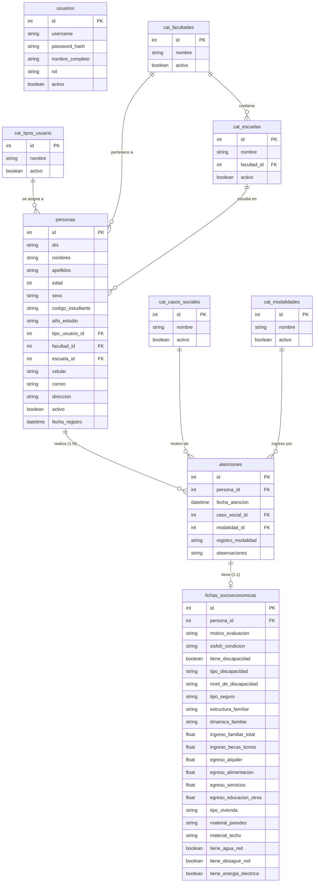

# Arquitectura del Sistema de Gestión Social

Este documento contiene la descripción técnica detallada de la arquitectura de software, flujo de comunicación, diseño del frontend, backend e infraestructura de persistencia de datos (Base de Datos) del **Sistema de Gestión Social (Servicio Social - Sistema de Gestión Universitaria)**.

---

## 1. Arquitectura General y Flujo de Comunicación

### 1.1 Modelo de Ejecución Local (Standalone / Offline-First)
El **Sistema de Gestión Social** está diseñado bajo un modelo de **aplicación de escritorio local independiente (Standalone Desktop App)** de arquitectura monolítica modular. La totalidad del sistema se ejecuta localmente en la máquina del cliente, eliminando la dependencia de servidores externos para su operación principal.

Esto aporta tres ventajas clave de acuerdo con los requerimientos de la bitácora:
- **Latencia Cero**: Las consultas de datos, filtrados y operaciones de guardado ocurren localmente en cuestión de milisegundos.
- **Privacidad y Soberanía de Datos**: La información de los estudiantes se mantiene exclusivamente en el disco duro local, cumpliendo de forma natural con políticas de protección de datos personales.
- **Tolerancia Completa a Fallas de Red**: El sistema opera de manera 100% desconectada de internet.

### 1.2 Flujo de Comunicación y Protocolos
Aunque no cuenta con un backend en la nube o una API HTTP externa tradicional, la comunicación dentro del sistema está bien definida mediante canales internos:

1. **Comunicación Vista-Lógica (Loopback/WebSocket)**:
   El framework **Flet** inicia el motor de renderizado gráfico de **Flutter** en una ventana independiente. Flet gestiona el estado y los eventos de los widgets visuales enviando datos de control bidireccionales mediante una conexión **WebSocket local** (`localhost` / `127.0.0.1`) en un puerto dinámico asignado en tiempo de ejecución.
2. **Acceso a Datos en Proceso (In-Process Database Call)**:
   La lógica en Python procesa los eventos visuales e interactúa con el motor de persistencia mediante llamadas a funciones locales. El **ORM SQLAlchemy** traduce estas acciones en sentencias SQL estructuradas y las envía directamente al motor **SQLite** embebido en el intérprete de Python a través de llamadas de I/O al sistema de archivos local (`database/servicio_social.db`), sin utilizar sockets TCP de bases de datos externas.
3. **Ciclo de Respaldos (Backup Manager)**:
   Al inicio y al término de cada ciclo de ejecución de la aplicación, el `BackupManager` analiza la configuración de respaldos del archivo JSON local (`config/backup_config.json`) y, si corresponde, realiza una copia directa a nivel de sistema operativo (`shutil.copy2`) de la base de datos hacia la carpeta configurada.

A continuación, se detalla el flujo de componentes y sus interfaces de comunicación en el siguiente diagrama:

```mermaid
graph TD
    subgraph Cliente (PC Local)
        subgraph Capa de Presentación (Frontend)
            UI["Motor Gráfico Flutter (Ventana UI Flet)"]
        end

        subgraph Capa de Lógica (In-Process Backend)
            Flet["Flet Engine (Python Event Loop)"]
            CTRLs["Controladores (Auth, Persona, Catalog)"]
            SEC["Seguridad (Bcrypt Hashing)"]
            BM["Gestor de Respaldos (BackupManager)"]
        end

        subgraph Capa de Persistencia (Datos)
            ORM["SQLAlchemy ORM (SessionLocal)"]
            DB[("Base de Datos SQLite (servicio_social.db)")]
            JSON["Config JSON (backup_config.json)"]
        end
    end

    %% Relaciones y Canales
    UI <-->|WebSocket Local / Loopback TCP| Flet
    Flet --> CTRLs
    Flet --> BM
    CTRLs --> ORM
    CTRLs --> SEC
    BM -->|Copia de Archivo Físico| DB
    BM <-->|Lectura/Escritura JSON| JSON
    ORM <-->|System File I/O (sqlite3)| DB
```

---

## 2. Frontend (Presentación)

El frontend está desarrollado con la biblioteca **Flet**, la cual sirve de interfaz para programar en Python pantallas y widgets construidos bajo el catálogo de diseño de **Flutter**. Se implementa un tema premium unificado en **Modo Oscuro** (por defecto) con soporte para cambio a **Modo Claro** en tiempo real.

El sistema se comporta como una SPA (*Single Page Application*) administrando las vistas de forma dinámica mediante un contenedor raíz en `main.py` y un menú de navegación lateral (`Sidebar`).

### 2.1 Catálogo de Vistas y Flujos Visuales

1. **Vista de Autenticación (`views/login_view.py`)**:
   - **Muestra**: Formulario estilizado de inicio de sesión con campos de `username` y `password` y logotipo de la aplicación.
   - **Control**: Controla el acceso inicial al sistema mediante la validación de contraseñas seguras contra la base de datos.
2. **Dashboard Principal (`views/dashboard_view.py`)**:
   - **Muestra**: Indicadores estadísticos globales.
   - **Detalles**:
     - Filtros globales interactivos por Mes y Año.
     - Indicadores rápidos (Cards) con el número de atenciones mensuales y desglose por tipo de caso (Evaluación, Seguimiento, Monitoreo/Orientación).
     - Gráficos de anillo para demografía de género (Varones/Mujeres) y clasificación de usuarios (Estudiantes/Egresados).
     - Un gráfico de barras de evolución temporal mensual.
     - Un ranking interactivo de Facultades con mayor número de estudiantes atendidos, el cual cuenta con un botón colapsable para optimizar espacio.
3. **Registro de Atenciones (`views/registro_view.py`)**:
   - **Muestra**: Formulario completo para registrar una nueva atención en la bitácora.
   - **Interactividad**:
     - Búsqueda en tiempo real por DNI: al ingresar un DNI de 8 dígitos existente, autocompleta los datos personales y académicos previamente guardados.
     - Selectores dependientes de facultades y escuelas: al seleccionar una facultad, habilita el selector de escuelas y lo filtra dinámicamente con las escuelas asociadas.
     - Campos condicionales: si se elige una modalidad de ingreso especial (como discapacidad), se muestra dinámicamente un campo de entrada para el N° de Registro o carnet (CONADIS).
     - Enlace directo a la Ficha Socioeconómica si la atención ingresada es calificada como caso social de "Evaluación".
4. **Gestión de Estudiantes y Atenciones (`views/personas_view.py`)**:
   - **Muestra**: Tabla paginada de registros en el sistema.
   - **Características**:
     - División lógica por pestañas: *Activos* (registros vigentes) e *Inactivos* (registros archivados).
     - Filtros de búsqueda por texto (DNI, nombres, apellidos, código) combinados con filtros múltiples mediante checkboxes de modalidades y fechas.
     - Ordenamiento ascendente/descendente de columnas.
     - Acciones sobre registros: Editar (abre un diálogo modal de actualización), Cambiar Estado (Activar/Desactivar), Eliminar Físicamente (solo para inactivos y mediante modal de confirmación) y Exportar a Excel (formateado OpenXML).
5. **Evaluaciones Socioeconómicas (`views/evaluaciones_view.py` y `socioeconomic_dialog.py`)**:
   - **Muestra**: Indicadores de vulnerabilidad y la bandeja de Fichas Socioeconómicas de los estudiantes.
   - **Detalles**:
     - Tarjetas con ingresos promedios familiares, egresos promedios y clasificación de vulnerabilidad SISFOH (Pobre, Pobre Extremo, No Pobre) junto con métricas de acceso a servicios públicos (Agua, Luz y Desagüe).
     - Formulario de Ficha Socioeconómica premium estructurado en un diálogo modal con tres pestañas:
       1. *Salud y SISFOH*: Condición de pobreza, seguros y detalles de discapacidad.
       2. *Familia y Economía*: Estructura y dinámica familiar, e ingresos/egresos numéricos con autocompletado y validación de decimales en tiempo real.
       3. *Vivienda*: Material de construcción de paredes y techos, y switches lógicos para los servicios básicos.
6. **Módulo de Configuración (`views/config_view.py`)**:
   - **Muestra**: Control de catálogos y copias de seguridad.
   - **Detalles**:
     - Formularios CRUD para tablas maestras: Facultades, Escuelas Profesionales, Tipos de Usuario, Casos Sociales y Modalidades.
     - Panel de Respaldos: Configuración de respaldos automáticos, intervalo de periodicidad, selección nativa de rutas en disco y botón para generación manual.

---

## 3. Backend (Lógica de Negocio y Control)

Al ser una aplicación local, la capa de lógica del backend se ejecuta dentro de los mismos hilos del proceso de Python. Sigue un patrón estructural de **Controladores (Controllers)** y utilidades core para mantener el principio de responsabilidad única.

### 3.1 Componentes de Control de Datos (`controllers/`)
- **`auth_controller.py`**:
  Gestiona la autenticación del usuario. Busca el registro activo en la base de datos por `username` y compara el hash cifrado de la contraseña.
- **`persona_controller.py`**:
  Contiene toda la lógica de filtrado de datos, paginación, inserciones en la base de datos, actualización de bitácoras y fichas socioeconómicas, además de la lógica de exportación a hojas de cálculo con `pandas` y `openpyxl`.
- **`catalog_controller.py`**:
  Centraliza las operaciones CRUD necesarias para poblar y editar las listas de selección o catálogos maestros del sistema.

### 3.2 Utilidades Core de Soporte (`core/`)
- **Seguridad (`core/security.py`)**:
  Implementa funciones de encriptación basadas en la librería **`bcrypt`**. Las contraseñas se almacenan como hashes con sal, impidiendo la exposición de credenciales en caso de que el archivo SQLite sea sustraído.
- **Administración de Respaldos (`core/backup_manager.py`)**:
  Se encarga del ciclo de vida del respaldo físico del archivo `.db`. Lee y escribe en el archivo JSON de configuración local y verifica si se debe disparar el respaldo automático al iniciar o cerrar la aplicación.
- **Ayudantes de UI (`core/ui_helpers.py`)**:
  Proporciona temas visuales, decoraciones, fuentes tipográficas y unifica el despliegue de `Snackbars` y alertas de errores para mantener la coherencia estética en la interfaz gráfica.

---

## 4. Base de Datos (Persistencia)

El motor de almacenamiento utilizado es **SQLite**, una base de datos relacional de archivos locales embebida en el sistema, lo que garantiza portabilidad e independencia de infraestructura externa.

### 4.1 ORM SQLAlchemy
Toda la lógica de comunicación con SQLite está administrada por **SQLAlchemy**. El ORM proporciona las siguientes medidas de calidad y seguridad:
- **Protección contra Inyección SQL**: Todas las consultas a la base de datos se generan a través de objetos de consulta parametrizados de SQLAlchemy, eliminando el riesgo de inyecciones maliciosas de código SQL.
- **Mapeo Relacional de Objetos**: Permite declarar las entidades de datos mediante clases de Python, mapeando claves foráneas y relaciones directamente en el código de forma segura.

### 4.2 Modelo Relacional de Datos
El esquema relacional mapeado en `database/models.py` sigue la siguiente estructura de tablas:



#### Descripción de Tablas Principales:
*   **`personas`**: Entidad principal que almacena los datos demográficos permanentes de los estudiantes (DNI único, nombres, facultad).
*   **`atenciones`**: Tabla transaccional que registra cada evento o visita del estudiante a la oficina. Al estar separada de `personas`, un mismo estudiante puede tener múltiples registros de atención en diferentes fechas sin duplicar su información personal.
*   **`fichas_socioeconomicas`**: Almacena los indicadores socioeconómicos, ingresos, egresos, y condiciones de vivienda. Está vinculada con una relación de uno a uno (`1:1`) con un registro de la tabla `atenciones` (cada atención de evaluación genera una ficha). Si se elimina una atención, su ficha se elimina en cascada (`cascade="all, delete-orphan"`).
*   **`usuarios`**: Almacena las credenciales de operadores y administradores.
*   **Catálogos Maestros (`cat_*`)**: Tablas de parametrización para centralizar y estandarizar datos (Escuelas, Facultades, Tipos de Usuario, Casos Sociales, Modalidades de Ingreso).

### 4.3 Inicialización y Carga Inicial (`core/init_db.py`)
El script de inicialización realiza las siguientes operaciones críticas de forma automatizada al arrancar la aplicación por primera vez:
1.  **Creación de Tablas**: Genera el archivo físico de base de datos (`servicio_social.db`) y ejecuta las sentencias DDL generadas por SQLAlchemy.
2.  **Usuario de Respaldo Inicial**: Crea de forma automática la cuenta del administrador principal (`admin` con la contraseña cifrada `admin123`).
3.  **Carga de Datos Reales**: Prepopula la base de datos con los nombres de las 14 facultades reales de la institución y sus respectivas escuelas profesionales (ej. Medicina Humana, Ingeniería Civil, Derecho y Ciencias Políticas, etc.), además de las modalidades de ingreso institucional y tipos de casos.
