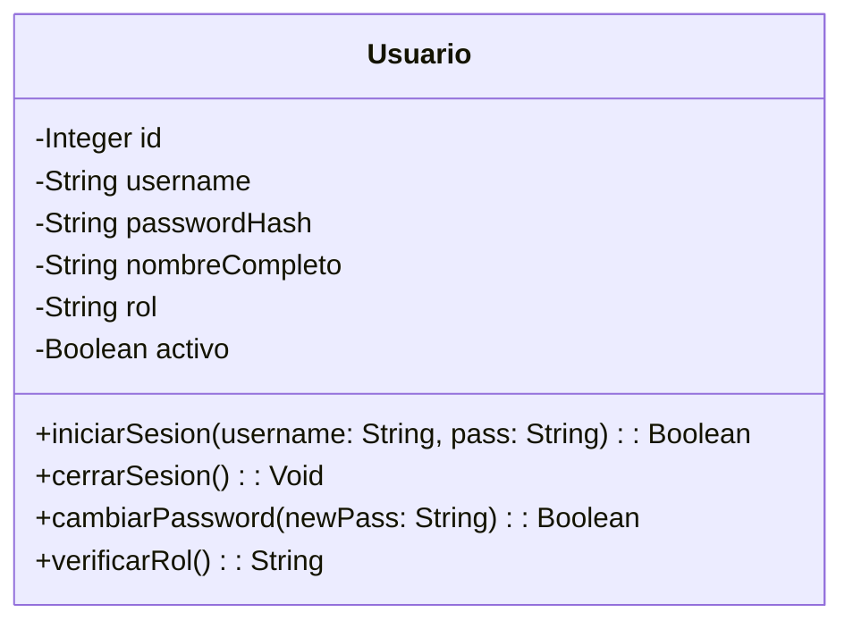
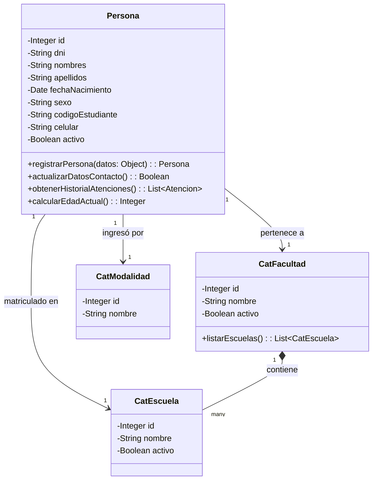
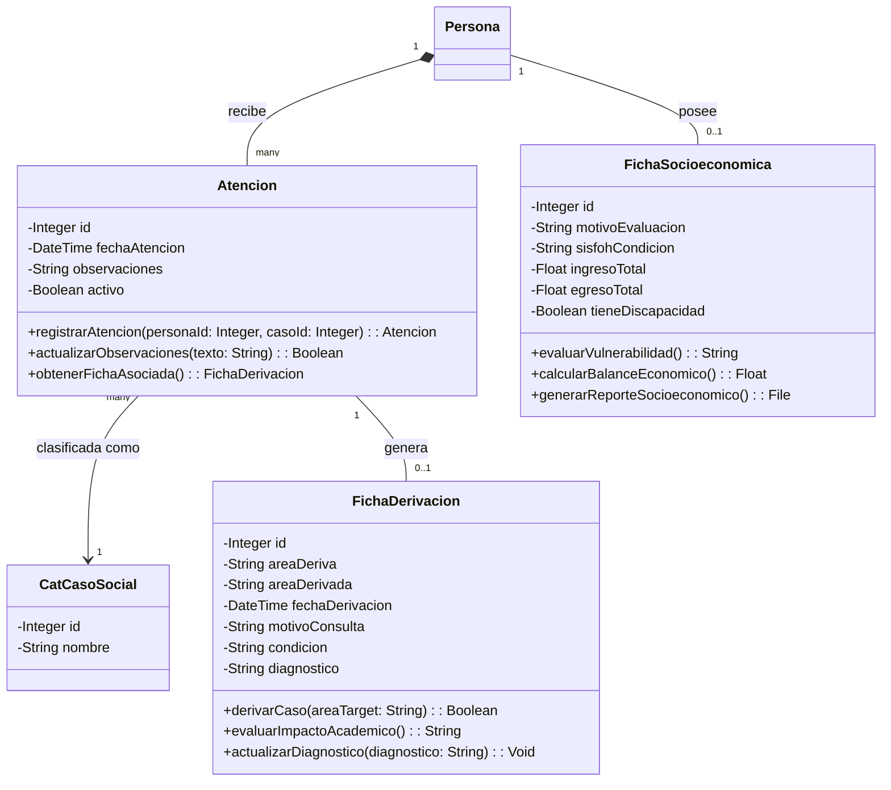

# Diagrama de Clases Lógico - Sistema Social

A diferencia de un diagrama de base de datos (que solo muestra tablas y llaves foráneas), el **diagrama de clases** modela la estructura lógica del software. En él definimos no solo las propiedades (atributos) que tiene una entidad, sino también los comportamientos (métodos/operaciones) que puede realizar en el sistema.

Dado que tu sistema es un gestor de Casos Sociales, hemos agrupado las clases por **Módulos Lógicos** e inferido los métodos típicos que cada clase ejecutaría en el backend (por ejemplo, registrar una atención, evaluar una ficha, etc.).

Puedes usar estos diagramas directamente en tu informe, o copiarlos en herramientas como [Mermaid Live](https://mermaid.live/) o Draw.io.

---

## 1. Módulo de Seguridad y Accesos

Este módulo gestiona a los operadores y administradores del sistema.

**Explicación:**
* La clase `Usuario` representa a las personas que operan el sistema (trabajadoras sociales, administradores). Sus métodos reflejan acciones lógicas como validarse en el sistema o cambiar su contraseña.

---

## 2. Módulo de Beneficiarios (Personas)

Gestiona la información central de los estudiantes o personas que reciben asistencia social.

**Explicación:**
* `Persona` es la clase central. Los métodos `obtenerHistorialAtenciones()` o `calcularEdadActual()` son lógica de negocio.
* Se relaciona con catálogos (Facultad, Escuela, Modalidad) para tipificar su perfil académico.

---

## 3. Módulo de Atenciones y Evaluación Social

Este es el núcleo de tu sistema, donde se registran las visitas, se hacen evaluaciones socioeconómicas y se derivan casos psicológicos o médicos.

**Explicación:**
* **`Atencion`**: Es el registro de cada visita de una `Persona` a la oficina de servicio social. Tiene métodos para registrar el evento y consultar datos.
* **`FichaSocioeconomica`**: Se asocia directamente a la `Persona` (relación 1 a 1). Contiene lógica crítica como `calcularBalanceEconomico()` (ingresos - egresos) y `evaluarVulnerabilidad()`.
* **`FichaDerivacion`**: Se genera a partir de una `Atencion` específica. Sus métodos incluyen la acción de derivar a un paciente y actualizar diagnósticos médicos/psicológicos.

---

## Recomendaciones para tu Informe

1. **Uso de UML**: Lo que te he generado utiliza la sintaxis **Mermaid** (que es un estándar muy usado para diagramar por código). Puedes tomar captura de estos diagramas visuales generados para ponerlos en tu Word/PDF.
2. **Separar por Módulos**: Tal como lo hice arriba, es mucho más profesional explicar el diagrama de clases **por módulos** (Seguridad, Beneficiarios, Fichas) que poner un diagrama gigante e incomprensible de 15 clases todas cruzadas.
3. **Inferencia de Métodos**: En Python (SQLAlchemy) solemos poner las clases de base de datos (`models.py`) solo con atributos. Sin embargo, en un diagrama de clases lógico (UML), **sí** debes poner los métodos (la lógica que hará tu API o tus controladores). Los métodos que he colocado (`calcularBalanceEconomico`, `derivarCaso`, `registrarAtencion`) son ejemplos perfectos de lo que los jurados o profesores esperan ver en un diagrama de clases.
