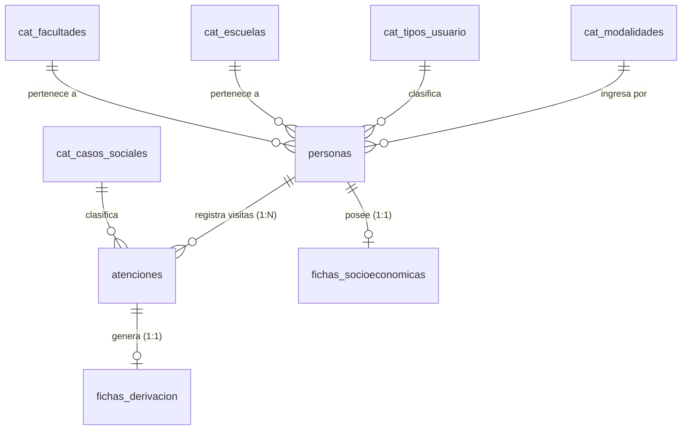

# Informe Técnico: Proceso de Normalización de la Base de Datos del Sistema Social

## Resumen Ejecutivo

El presente documento expone de manera detallada el proceso de diseño y normalización aplicado a la base de datos relacional del **Sistema Social**. La normalización es una técnica fundamental en la ingeniería de datos cuyo objetivo principal es eliminar la redundancia innecesaria, garantizar la integridad referencial y prevenir anomalías durante las operaciones de inserción, actualización y borrado de datos.

A continuación, se presenta la evolución arquitectónica del sistema desde una estructura plana (no normalizada) hasta la **Tercera Forma Normal (3FN)**, la cual representa la estructura óptima implementada en la arquitectura actual.

---

## 1. Estado Inicial: Fase Cero (Tabla Plana o Desnormalizada)

### Descripción del Estado Inicial
En la concepción inicial del registro asistencial, el flujo de información se concebía como una única tabla plana (similar a una hoja de cálculo). En este esquema, cada fila intentaba registrar al individuo, la transacción de atención y los datos socioeconómicos de forma simultánea.

### Ejemplo de la Tabla Plana (`Registro_Atencion`)

| DNI | Nombres | Apellidos | Facultad | Caso Social | Ingreso Familiar | Diagnóstico | Derivación |
|:---:|:---:|:---:|:---:|:---:|:---:|:---:|:---:|
| 12345678 | Juan | Pérez | Ingeniería | Orientación, Evaluación | 1500.00 | Ansiedad | Psicología |
| 87654321 | María | López | Ingeniería | Seguimiento | (Vacio) | (Vacio) | (Vacio) |
| 11223344 | Luis | Arias | Derecho | Orientación | (Vacio) | (Vacio) | (Vacio) |

### Diagnóstico de Problemas Estructurales
1. **Atomicidad Violada (Celdas Multivaluadas):** Se registraban múltiples valores separados por comas en una sola celda (ej. "Orientación, Evaluación"), imposibilitando consultas relacionales directas.
2. **Redundancia e Inconsistencia de Datos:** La información del beneficiario (nombres, facultad) se repetía en cada visita. Si una facultad cambiaba de denominación, requería actualizar múltiples registros, generando riesgo de inconsistencia.
3. **Anomalías por Espacios Nulos (`NULL` masivos):** Datos especializados (como ingresos económicos o diagnósticos clínicos) obligaban a crear columnas que la mayoría de atenciones no requerían, desperdiciando espacio y degradando el rendimiento.

---

## 2. Primera Forma Normal (1FN)

### Definición del Criterio
Una tabla cumple la **Primera Forma Normal** si y solo si:
- Todos sus atributos son **atómicos** (cada celda contiene un único valor indecomposable).
- No existen grupos repetitivos de columnas ni listas dentro de un campo.
- Existe una **Llave Primaria (Primary Key - PK)** que identifica de forma unívoca a cada fila.

### Justificación de las Transformaciones Aplicadas

1. **Descomposición de Celdas Multivaluadas:**
   - *Problema Detectado:* El campo `Caso Social` contenía valores compuestos como `"Orientación, Evaluación"`. Esto impedía realizar filtrados simples (ej. `WHERE caso_social = 'Orientación'`) o generar métricas estadísticas precisas por tipo de atención.
   - *Solución / Por qué se hizo:* Se duplicó la fila creando un registro individual por cada servicio prestado. Cada celda guarda ahora un único valor atómico.

2. **Creación de la Llave Primaria Sintética (`id` autoincrementable):**
   - *Problema Detectado:* Se intentaba usar el `DNI` como identificador de la fila. Si el DNI fuera la Llave Primaria, un estudiante solo podría registrarse **una sola vez en toda su vida universitaria**, imposibilitando el seguimiento de visitas futuras.
   - *Solución / Por qué se hizo:* Se creó una PK autoincrementable `id`. Esto permitió formalizar la entidad `atenciones` como una **bitácora transaccional**, donde cada fila representa un evento o visita independiente en el tiempo.

### Tabla Resultante en 1FN

| id (PK) | DNI | Nombres | Facultad | Caso Social | Ingreso Familiar | Diagnóstico |
|:---:|:---:|:---:|:---:|:---:|:---:|:---:|
| 1 | 12345678 | Juan Pérez | Ingeniería | Orientación | 1500.00 | Ansiedad |
| 2 | 12345678 | Juan Pérez | Ingeniería | Evaluación | 1500.00 | Ansiedad |
| 3 | 87654321 | María López | Ingeniería | Seguimiento | NULL | NULL |

*Estado en 1FN:* Se logra la atomicidad de los datos, pero persiste la redundancia de los datos del ciudadano y de los nombres de las facultades/casos.

---

## 3. Segunda Forma Normal (2FN)

### Definición del Criterio
Una tabla está en **Segunda Forma Normal** si está en 1FN y todos sus atributos no-clave dependen funcionalmente de manera **completa y directa** de la Llave Primaria (PK), y no de una parte de ella ni de otra entidad.

### Justificación de las Transformaciones Aplicadas

1. **Desacoplamiento de la Entidad `personas` (Datos Fijos del Usuario):**
   - *Problema Detectado:* Los nombres, apellidos, fecha de nacimiento y datos de contacto de Juan Pérez no cambian en cada visita al consultorio social. En 1FN, si Juan asistía 10 veces, su nombre se escribía 10 veces en la tabla de atenciones. Esto generaba redundancia masiva y riesgo de erratas (ej. escribir "Juan Pérez" en una fila y "Juan Perez" en otra).
   - *Solución / Por qué se hizo:* Se extrajo a los beneficiarios a una tabla dedicada llamada `personas`. La tabla de atenciones ahora solo almacena el puntero `persona_id (FK)`. Esto garantiza que los datos personales existan **una sola vez** en toda la base de datos.

2. **Parametrización mediante Tablas de Catálogo o Maestras (`cat_facultades`, `cat_escuelas`, `cat_modalidades`, `cat_casos_sociales`, `cat_tipos_usuario`):**
   - *Problema Detectado:* Escribir textos literales como `"Facultad de Ingeniería Civil y Arquitectura"` miles de veces ocupa un espacio innecesario en disco. Además, si la facultad cambia formalmente de nombre, habría que ejecutar actualizaciones masivas y propensas a errores en miles de registros.
   - *Solución / Por qué se hizo:* Se parametrizaron estos valores en tablas de catálogo estandarizadas. En lugar de almacenar el texto de la facultad o caso social, se guarda un identificador entero (FK de 4 bytes). Si el nombre de la facultad cambia, se corrige en un único lugar (`cat_facultades`), actualizando automáticamente la referencia para todos los usuarios.

3. **Definición de la Entidad Transaccional `atenciones`:**
   - *Por qué se hizo:* Al liberar a `atenciones` de los datos de la persona y de los nombres de los catálogos, la tabla quedó reducida exclusivamente a su responsabilidad real: registrar el evento o visita (`persona_id`, `fecha_atencion`, `caso_social_id`, `observaciones`).

### Esquema Físico Resultante en 2FN

#### Tabla: `cat_facultades`
| id (PK) | nombre |
|:---:|:---|
| 1 | Facultad de Ingeniería |
| 2 | Facultad de Derecho |

#### Tabla: `personas`
| id (PK) | dni (UNIQUE) | nombres | apellidos | facultad_id (FK) |
|:---:|:---:|:---|:---|:---:|
| 1 | 12345678 | Juan | Pérez | 1 |
| 2 | 87654321 | María | López | 1 |

#### Tabla: `atenciones`
| id (PK) | persona_id (FK) | fecha_atencion | caso_social_id (FK) |
|:---:|:---:|:---:|:---:|
| 1 | 1 | 2026-03-10 | 1 |
| 2 | 1 | 2026-06-20 | 2 |
| 3 | 2 | 2026-04-05 | 3 |

> **Nota Metodológica sobre Visualización:** Aunque en las vistas del sistema (UI) el nombre del beneficiario aparezca repetido en la lista de atenciones, en el motor de base de datos **no existe duplicidad**. La vista se construye mediante cláusulas `JOIN` dinámicas a partir de la tabla `personas`.

---

## 4. Tercera Forma Normal (3FN)

### Definición del Criterio
Una tabla está en **Tercera Forma Normal** si está en 2FN y **no existen dependencias transitivas**; es decir, ningún atributo no-clave depende de otro atributo no-clave. Todos los campos deben depender exclusivamente de la Llave Primaria de su tabla.

### Justificación de las Transformaciones Aplicadas: Segregación de Fichas Especializadas

En la tabla `atenciones` de la 2FN aún existía un problema crítico: se incluían campos como `ingreso_economico_miembros`, `material_vivienda`, `diagnostico` y `area_derivada`. 

*Problema de Fondo:* La gran mayoría de visitas cotidianas son consultas breves u orientaciones simples que **no requieren una evaluación socioeconómica completa ni una derivación clínica**. Mantener esas columnas en `atenciones` provocaba que el 80% de los registros estuvieran llenos de valores nulos (`NULL`), desperdiciando almacenamiento y ensuciando el modelo.

Para eliminar las dependencias transitivas y los campos `NULL` desaprovechados, se dividieron estos formularios en **dos fichas especializadas independientes**:

#### A. Ficha Socioeconómica (`fichas_socioeconomicas`) — Cardinalidad 1:1 con `personas`
- **¿Por qué se aisló?:** Los datos del hogar (materiales de paredes, techo, ingresos familiares, tenencia de servicios) dependen del **estudiante/persona**, no del momento exacto de una atención de 15 minutos.
- **Justificación de Negocio:** La condición socioeconómica del beneficiario es semi-permanente. Se evalúa de forma integral y se actualiza periódicamente (ej. una vez al año). Sería incorrecto e ineficiente obligar a llenar una evaluación de vivienda cada vez que la persona solicita una constancia o consulta rápida.
- **Implementación Física:** Se vincula a `personas` mediante `persona_id (FK, UNIQUE)`. El atributo `UNIQUE` impone la restricción de que exista **máximo una ficha por persona**.

#### B. Ficha de Derivación (`fichas_derivacion`) — Cardinalidad 1:1 con `atenciones`
- **¿Por qué se aisló?:** El diagnóstico clínico, motivo de consulta detallado y área de destino son dependencias clínicas de **una visita médica o psicológica específica**, no del perfil general de la persona.
- **Justificación de Negocio:** Una persona puede tener 5 atenciones en el año, pero solo en la 2da y 5ta visita fue derivada a Psicología. Crear la ficha de derivación como una entidad aparte permite generarla **únicamente cuando el caso lo requiera**.
- **Implementación Física:** Se vincula a `atenciones` mediante `atencion_id (FK, UNIQUE)`. El atributo `UNIQUE` asegura que cada atención concreta tenga a lo sumo una ficha de derivación asociada.

### Esquema Físico Final en 3FN

#### Estructura Consolidada de Tablas en 3FN:

1. **`personas`** (Información biográfica permanente)
   - `id` (PK), `dni` (UNIQUE), `nombres`, `apellidos`, `fecha_nacimiento`, `tipo_usuario_id` (FK), `facultad_id` (FK), `escuela_id` (FK), `modalidad_id` (FK), etc.
2. **`atenciones`** (Transacciones / Bitácora de visitas)
   - `id` (PK), `persona_id` (FK), `fecha_atencion`, `caso_social_id` (FK), `observaciones`.
3. **`fichas_socioeconomicas`** (Perfil socioeconómico y vivienda - 1:1 con `personas`)
   - `id` (PK), `persona_id` (FK, UNIQUE), `sisfoh_condicion`, `ingreso_economico_miembros`, `egreso_alimentacion`, `tipo_vivienda`, `material_paredes`, etc.
4. **`fichas_derivacion`** (Atención clínica / derivación especializada - 1:1 con `atenciones`)
   - `id` (PK), `atencion_id` (FK, UNIQUE), `area_deriva`, `area_derivada`, `motivo_consulta`, `diagnostico`, etc.

---

## 5. Decisiones Arquitectónicas del Diseño

### 5.1. Manejo de la Relación Beneficiario vs. Casos Sociales
En el dominio del problema, una persona puede presentar múltiples casos sociales a lo largo de su vida universitaria, y un caso social es asignado a muchas personas. En el modelado tradicional, esto sugeriría una relación Muchos a Muchos (N:M) mediante una tabla intermedia.

**Solución Optimizada Implementada:**
Al modelar `atenciones` como una bitácora transaccional (1FN/2FN), cada fila representa un contacto puntual en una fecha dada. En ese evento específico, la persona recibe un **único caso social**. 

Esto convierte la complejidad N:M en una estructura relacional limpia `1:N`:
- `personas` (1:N) `atenciones`
- `cat_casos_sociales` (1:N) `atenciones`

Se elimina la necesidad de tablas de unión intermedias sin perder la trazabilidad histórica de los casos atendidos.

---

## 6. Cuadro Resumen de Cumplimiento de Normalización

| Forma Normal | Regla Principal | Problema Previo Encontrado | Solución Técnica Aplicada | Beneficio Directo Obtenido |
|:---:|:---|:---|:---|:---|
| **1FN** | Atomicidad de atributos y existencia de Primary Key. | Celdas con múltiples casos separados por comas ("Orientación, Evaluación"). Uso del DNI como clave imposibilitaba re-atenciones. | Descomposición en filas individuales e inclusión de `id` autoincrementable como PK. | Consultas exactas sin análisis de sub-strings y soporte de historial de visitas. |
| **2FN** | Dependencia funcional completa de la PK. | Nombres de alumnos y facultades repetidos en cientos de atenciones, propensos a erratas e inconsistencias. | Desacoplamiento de la entidad `personas` y parametrización de catálogos (`cat_facultades`, etc.) mediante FKs. | Eliminación de la redundancia de datos personales; edición centralizada en un solo punto. |
| **3FN** | Eliminación de dependencias transitivas. | Campos socioeconómicos y de derivación mezclados en la tabla de atenciones, provocando un 80% de valores `NULL`. | Segregación de `fichas_socioeconomicas` (1:1 con `personas`) y `fichas_derivacion` (1:1 con `atenciones`). | Tablas limpias sin campos `NULL` innecesarios, máxima eficiencia de almacenamiento e integridad referencial. |

---

## Conclusión

La base de datos del **Sistema Social** cumple rigurosamente con los estándares de la **Tercera Forma Normal (3FN)**. Cada cambio estructural responde a una justificación técnica y de negocio clara, logrando un sistema altamente escalable, sin redundancia descontrolada y con un consumo óptimo de almacenamiento.
